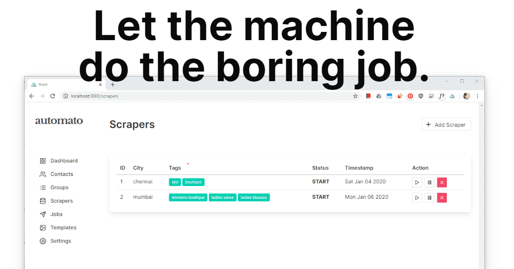

     

 
 

Web Application to automate sending Whatsapp Messages , SMS &amp; Email campaigns( WIP ).

## Features

 * Scrape business data from Google Maps , IndiaMart ( more coming soon )
 * Mange your contacts , tag them to send specialized campaigns.  
 * Manage and edit contact/business .
 * Import/ Export Data ( WIP ) out of Automato
 * Setup templates for campaigns
 * Send Whatsapp and SMS campaigns without any extra cost

## Installation & Setup

*NOTE:* You'll need to use python3. 

To install requirements :

> Clone or download https://github.com/padamsethia/automato

> Run pip install -r requirements.txt in automato/back

> Run npm install in automato/front

> npm run dev to run the frontend at automato/front

> python run.py to run the backend at automato/back

> python huey-consumer.py tasks.huey to run the consumer at automato/back

Automato requires the following softwares to work  , please follow the setup from the offical docs.

* [Selenium](https://www.seleniumhq.org/)
* [MySQL](https://www.mysql.com/downloads/) as backend database 

## Issues and Requests
For any issue or requests , kindly use Github Issues.

## Projects Used
* [Bulma CSS](http://getskeleton.com)
* Flask
* Buefy
* Vue.js
* SQLAlchemy 
* Albemic

## License
This project is licensed under the [MIT License](./LICENSE).
